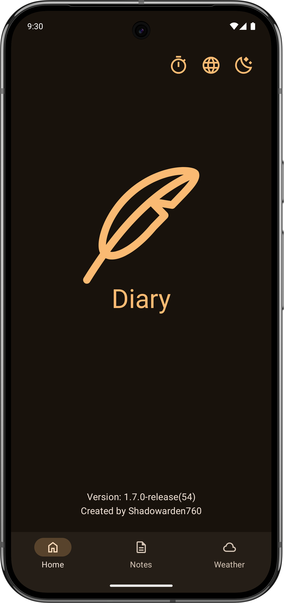
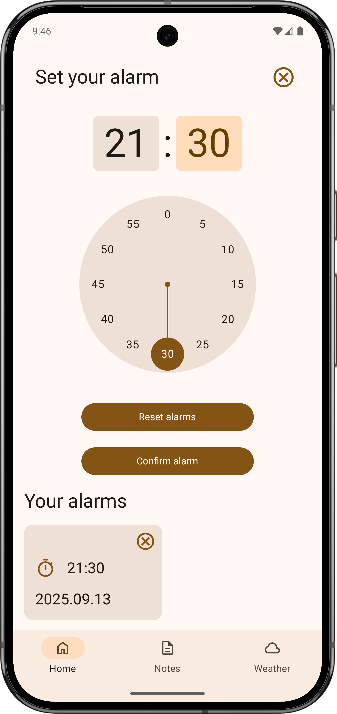
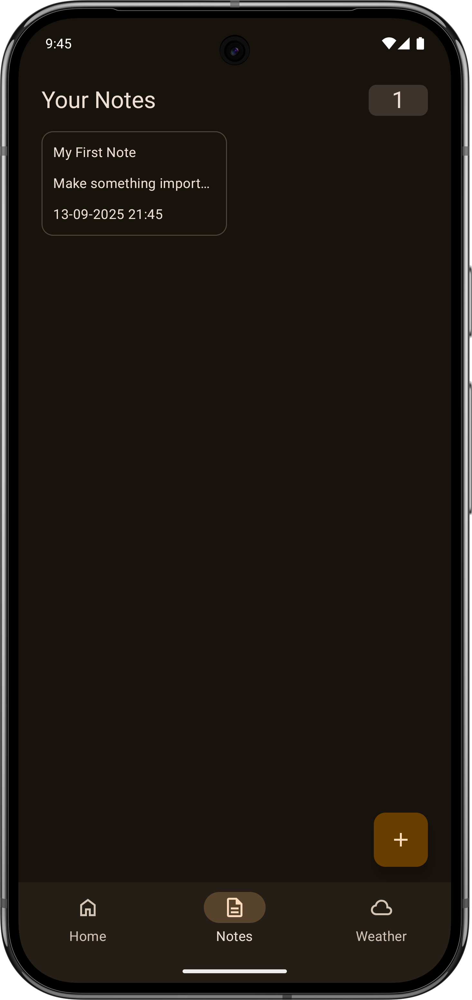
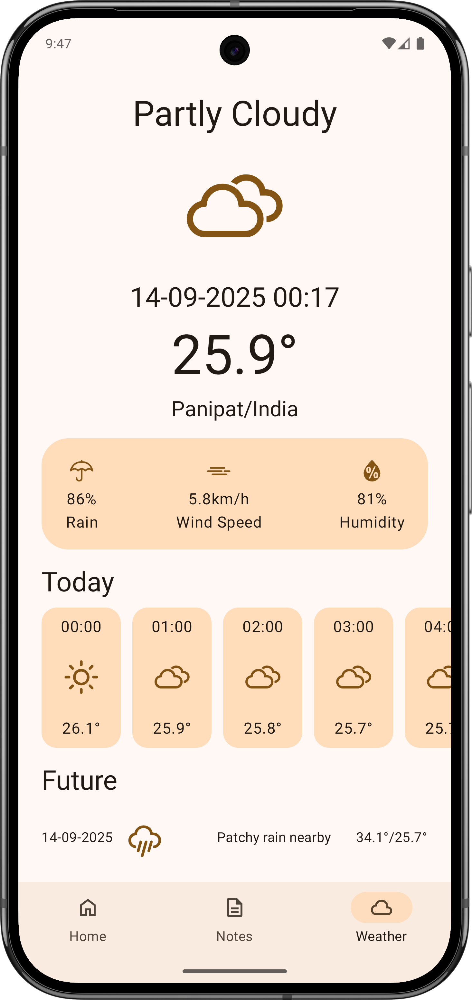
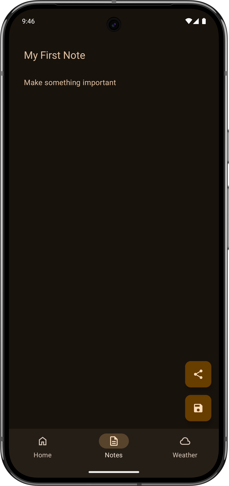
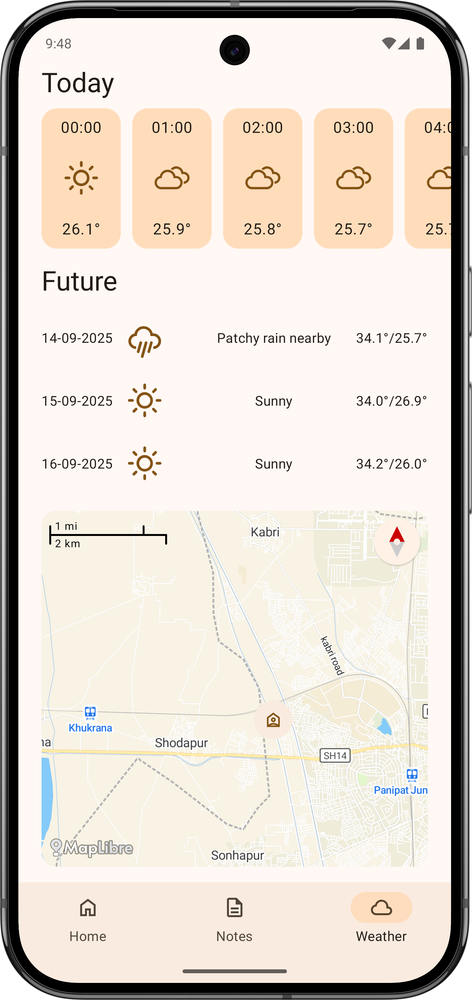

# 📔 Diary  

[](https://kotlinlang.org)  
[](LICENSE)  

A minimalist Android app for **note-taking** and **weather tracking** in your region. Organize thoughts and stay prepared for the day ahead!  

---

## ✨ Features  
✅ **Notes Management**  
- Create, edit, and organize text-based notes.  
- Fast search and intuitive UI.  
- Share notes via other apps (messengers, email, etc.).
- Export & Backup all your notes to a single JSON file.

🌤️ **Weather Integration**  
- Real-time weather forecasts for your location.  
- Minimalist weather cards with essential details.  
- Smart Location Detection: uses precise GPS or network/IP as a fallback.
- Interactive Map view of your current location when GPS is available.

🔔 **Daily Reminders**
- Set multiple customizable daily reminders.
- Get notified to check your diary and the weather, helping you build a consistent habit.

🎨 **Customization**  
- Dark/Light theme support.  
- Multi-language localization (English, Russian).  

---

## 📸 Screenshots

|                        Dark Theme                         |                          Light Theme                          |
|:---------------------------------------------------------:|:-------------------------------------------------------------:|
|                       *Main Screen*                       |                    *Alarm Settings Screen*                    |
|         |  |
|                  *Screen with Note List*                  |                        *Weather View*                         |
|    |     |
|                 *Screen with Note Detail*                 |                    *Weather View with Map*                    |
|  |  |

---

## 🛠 Tech Stack  
- **Language**: [Kotlin](https://kotlinlang.org/)  
- **UI**: [Jetpack Compose](https://developer.android.com/jetpack/compose) (Modern declarative UI)  
- **Networking**: [Ktor](https://ktor.io/) (Weather API integration)  
- **Database**: [SQLDelight](https://cashapp.github.io/sqldelight/) (Local note storage)  
- **DI**: [Koin](https://insert-koin.io/) (Dependency injection)  
- **Async**: [Coroutines/Flow](https://kotlinlang.org/docs/coroutines-overview.html)  
- **Maps**: [MapLibre](https://maplibre.org/) (For displaying interactive maps)
- **Alarm Manager**: For scheduling reliable daily reminders

---

## ⬇️ Installation  
### Option 1: Download APK  
Grab the latest release from [Releases](https://github.com/Shadowarden760/Diary/releases).  

### Option 2: Build Locally  
```bash
git clone https://github.com/Shadowarden760/Diary.git
cd Diary
./gradlew assembleDebug -DDEBUG_STORE_FILE="" -DDEBUG_STORE_PASSWORD="" -DDEBUG_KEY_ALIAS="" -DDEBUG_KEY_PASSWORD=""
 -DWEATHER_API_URL="" -DIP_API_URL="" -DMAP_API_URL="" -DWEATHER_API_KEY="" -DMAPTILER_API_KEY=""
